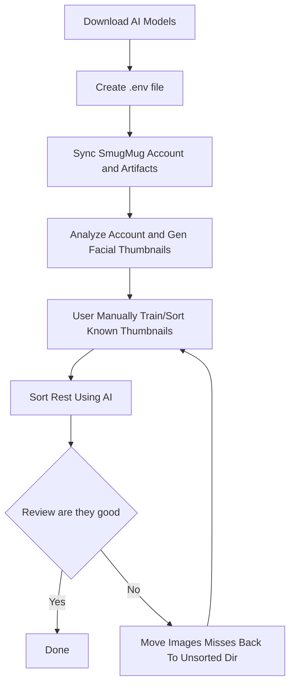

# How to label images

These are instructions on how to create labels using AI facial recognition and update
the images stored in SmugMug with those keywords.

Summary of the process:

- Sync the SmugMug account metadata and artifacts.
- Generate mathematical fingerprints and thumbnails from the images.
- User manually sorts/moves a subset into folders.
- This tool will then compare the rest of the unsorted images with the
  pre-sorted ones
  and sort the matches into folder names matching the pre-sorted ones.
- An json file with label mappings will be created that will then be used by
  this tool to update the images in SmugMug

My Flow:



## Download the models

Create a directory to store the AI models and download them to that location.
The model files needs to be unzipped (bunzip2) in this case.

Create a `.env` in the working directory or set the env variable as indicated
file with an entry pointing to the download path:

```text
SMUGMUG_SYNC_MODELS_DIR=<Path to model files>
```

The following model files are required:

- [shape_predictor_68_face_landmarks](https://dlib.net/files/shape_predictor_68_face_landmarks.dat.bz2)
- [dlib_face_recognition_resnet_model_v1](https://dlib.net/files/dlib_face_recognition_resnet_model_v1.dat.bz2)
- [mmod_human_face_detector](https://dlib.net/files/mmod_human_face_detector.dat.bz2)

## Create a .env file

`.env` file takes care of some of the repetitiveness of the CLI interface and
work well when running in docker as well. A `.env` file is not required however
when not used some of these environment variables are required to be set.

[Using a .env file in Docker](https://khabdrick-dev.medium.com/use-an-env-file-in-docker-286ec79d4543)

Example of my `.env` file

```console
SMUGMUG_API_KEY=<API_KEY>
SMUGMUG_API_SECRET=<API_SECRET>
SMUGMUG_AUTH_CACHE=<PATH TO STORE CACHED AUTH CREDS>
SMUGMUG_SYNC_LOCATION=<PATH TO SYNC SMUGMUG ACCOUNT TO (--syncto)>
SMUGMUG_SYNC_MODELS_DIR=<PATH TO AI MODELS DIR>
SMUGMUG_NICKNAME=<SMUGMUG ACCOUNT NICKNAME>
SMUGMUG_SYNC_WORKERS=2
```

## Sync the artifacts

At the moment, the images need to be downloaded to the syncto directory
and explained in the [README](README.md)

## Analyze the images

Run this command to start the analysis of the images.

```console
smugmug-syncer tags --gen-thumbnails-and-embedding
```

This will create a `facial_detections` path at the `--syncto` location.
In that directory will be an `embeddings` and `thumbnails` folder.
The `embeddings` folder contains the mathematical fingerprint for the facial
images found in the `thumbnails` folder.

## "Train" the image sorter (manually)

This part is manual. A directory will need to be created where manually sorted
thumbnails are collected. This will give the comparator process something to
work with to sort images later. The subdirectory names _becomes the labels_.

Move the images from the `thumbnails` dir into these sorted dirs as they do not
need to be re-analyzed and will be included in the label calculations.

I created a `presorted` folder under the `facial_detections`
directory and looked something like this:

```console
../facial_detections/
  /Billy/
    2sfas_1.jpg
    ...
  /Bob/
    c2342s_0.jpb
    ...
  /Jodie/
    ...
```

The more images you presort the better the results will be.

## Now do the sorting and generate the labels

```console
smugmug-syncer tags --gen-labels --presorted-thumbnails-dir <path to presorted dir>
```

This utility will look at the presorted dir and run though all the images left
in the `thumbnails` directory and if it finds a match will move them into a
`facial_detections/sorted_thumbnails/<labels>` where the labels match the dir
names used in the presorted dir.

Once this is complete a `facial_tags.json` file will be created at the root of
the `facial_detections` dir with a mapping of labels to images (not the thumbnails)

\*\*Note if I didn't have very many images for a specific label in the presort
my sorted dir was messy with duplicates. If you are getting to much of the
wrong images then add more relevant images to the presorted directory.

## Update SmugMug

```console
smugmug-syncer tags --update-smugmug-tags
```

Running this command will read the `facial_tags.json` file and update SmugMug
with the images it finds.

After this step you will want to do a `--force` update of the metadata to sync
back the keyword changes.
